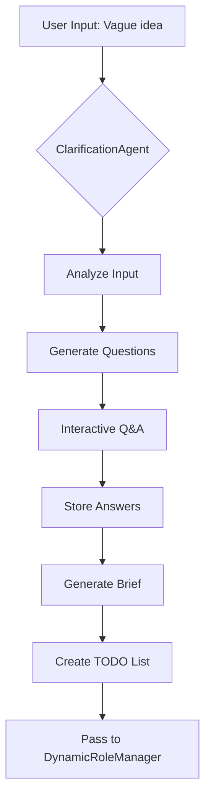

# Clarification Module - Technical Specification

**Module:** `agents/clarification_agent.py`
**Status:** In Development
**Dependencies:** CrewAI, interactive_tools, clarification_storage

---

## 🎯 Purpose

The Clarification Module transforms vague user requirements into detailed, actionable project specifications through intelligent questioning.

---

## 🔄 Flow Diagram



---

## 📋 Question Categories

### 1. Technical Stack
```yaml
questions:
  - "What programming language do you prefer? (Python, JavaScript, TypeScript, Go)"
  - "Frontend framework? (React, Vue, Next.js, Angular, None)"
  - "Backend framework? (FastAPI, Django, Express, Flask, None)"
  - "Database? (PostgreSQL, MongoDB, MySQL, SQLite)"
  - "Authentication method? (JWT, OAuth2, Session-based)"
```

### 2. Project Scope
```yaml
questions:
  - "Project complexity? (Simple/Medium/Complex)"
  - "Expected features? (List 3-5 main features)"
  - "Third-party integrations? (Payment, Email, SMS, etc.)"
  - "Admin panel required? (Yes/No)"
  - "Multi-language support? (Yes/No + Languages)"
```

### 3. Deployment & Infrastructure
```yaml
questions:
  - "Deployment target? (Docker, AWS, Vercel, Heroku, Local)"
  - "CI/CD required? (Yes/No)"
  - "Monitoring/Logging? (Yes/No)"
  - "Scalability requirements? (Expected users: 100/1K/10K/100K+)"
```

### 4. Quality & Testing
```yaml
questions:
  - "Test coverage target? (60%/80%/90%)"
  - "Testing types? (Unit/Integration/E2E)"
  - "Code quality standards? (PEP8, ESLint, etc.)"
  - "Documentation level? (Basic/Standard/Comprehensive)"
```

### 5. Constraints
```yaml
questions:
  - "Budget limit? (API cost constraint)"
  - "Timeline? (Days/Weeks)"
  - "Performance requirements? (Response time < Xms)"
  - "Security level? (Standard/High/Critical)"
```

---

## 💾 Storage Format

### Brief JSON Schema
```json
{
  "project_id": "ecommerce_20251027_143022",
  "timestamp": "2025-10-27T14:30:22Z",
  "user_input": "E-commerce site",

  "clarifications": {
    "tech_stack": {
      "language": "Python",
      "frontend": "Next.js",
      "backend": "FastAPI",
      "database": "PostgreSQL",
      "authentication": "JWT"
    },

    "features": [
      "Product catalog with CRUD",
      "Shopping cart",
      "User authentication",
      "Payment processing (Stripe)",
      "Admin dashboard",
      "Order management"
    ],

    "infrastructure": {
      "deployment": "Docker",
      "ci_cd": true,
      "monitoring": true,
      "scalability": "1K users"
    },

    "quality": {
      "test_coverage": 80,
      "testing_types": ["unit", "integration"],
      "documentation": "standard"
    },

    "constraints": {
      "budget": "$5.00",
      "timeline": "2 weeks",
      "performance": "< 200ms",
      "security": "high"
    }
  },

  "auto_generated": {
    "required_agents": [
      "Planner", "Coder", "Tester", "Reviewer", "Documenter",
      "SecurityAgent", "DevOpsAgent"
    ],

    "todo_list": [
      {
        "task": "Setup project structure",
        "agent": "Planner",
        "priority": "HIGH",
        "estimated_cost": "$0.10"
      },
      {
        "task": "Create database schema",
        "agent": "Coder",
        "priority": "HIGH",
        "estimated_cost": "$0.30"
      },
      {
        "task": "Implement authentication",
        "agent": "SecurityAgent",
        "priority": "HIGH",
        "estimated_cost": "$0.50"
      },
      {
        "task": "Setup Stripe integration",
        "agent": "Coder",
        "priority": "MEDIUM",
        "estimated_cost": "$0.40"
      },
      {
        "task": "Create Docker configuration",
        "agent": "DevOpsAgent",
        "priority": "MEDIUM",
        "estimated_cost": "$0.20"
      },
      {
        "task": "Write tests",
        "agent": "Tester",
        "priority": "HIGH",
        "estimated_cost": "$0.60"
      }
    ],

    "estimated_total_cost": "$2.10",
    "estimated_duration": "45 minutes"
  }
}
```

---

## 🧠 Intelligent Question Generation

### Adaptive Questioning
```python
class ClarificationStrategy:
    """
    Dynamically generates questions based on user input analysis
    """

    def analyze_input(self, user_input: str) -> dict:
        """
        Use LLM to extract intent from vague input
        """
        keywords = self.extract_keywords(user_input)
        # "e-commerce" → need payment, cart, products
        # "dashboard" → need charts, auth, admin
        # "API" → need endpoints, database, docs

        return {
            "project_type": self.detect_type(keywords),
            "implied_features": self.infer_features(keywords),
            "complexity_estimate": self.estimate_complexity(keywords)
        }

    def generate_questions(self, analysis: dict) -> list:
        """
        Generate relevant questions based on analysis
        """
        questions = []

        # Always ask basics
        questions.extend(self.BASIC_QUESTIONS)

        # Add project-specific questions
        if analysis["project_type"] == "e-commerce":
            questions.extend(self.ECOMMERCE_QUESTIONS)
        elif analysis["project_type"] == "dashboard":
            questions.extend(self.DASHBOARD_QUESTIONS)

        # Add complexity-based questions
        if analysis["complexity_estimate"] == "high":
            questions.extend(self.ADVANCED_QUESTIONS)

        return questions
```

### Question Templates

#### E-commerce Specific
```python
ECOMMERCE_QUESTIONS = [
    "Payment gateway? (Stripe, PayPal, Square, None)",
    "Inventory management? (Yes/No)",
    "Product reviews/ratings? (Yes/No)",
    "Shipping integration? (Yes/No)",
    "Discount/Coupon system? (Yes/No)",
    "Multi-vendor support? (Yes/No)",
]
```

#### Dashboard Specific
```python
DASHBOARD_QUESTIONS = [
    "Chart library? (Chart.js, D3.js, Recharts)",
    "Real-time updates? (Yes/No)",
    "Export capabilities? (PDF, Excel, CSV)",
    "User roles? (Admin/User/Guest)",
    "Data refresh rate? (Real-time/Every 5min/Manual)",
]
```

#### API Specific
```python
API_QUESTIONS = [
    "API style? (REST, GraphQL)",
    "Authentication? (JWT, OAuth2, API Key)",
    "Rate limiting? (Yes/No)",
    "API documentation? (Swagger, Postman, None)",
    "Versioning? (Yes/No)",
]
```

---

## 🎨 User Interaction Modes

### Mode 1: Full Interactive (Default)
```bash
python main.py --idea "E-commerce" --mode enhanced

>>> YAGO: What frontend framework? (React/Vue/Next.js/None)
>>> User: Next.js
>>> YAGO: Database? (PostgreSQL/MongoDB/MySQL)
>>> User: PostgreSQL
>>> ... (8-12 questions total)
```

### Mode 2: Quick Mode (Minimal Questions)
```bash
python main.py --idea "E-commerce" --mode enhanced --clarification-depth minimal

>>> YAGO: Tech stack? (Python+FastAPI / Node+Express / Go)
>>> User: Python+FastAPI
>>> YAGO: Database? (PostgreSQL / MongoDB)
>>> User: PostgreSQL
>>> ... (3-4 questions total)
```

### Mode 3: AI-Inferred (No Interaction)
```bash
python main.py --idea "E-commerce with Stripe" --mode enhanced --clarification-depth auto

>>> YAGO: Analyzing input... ✓
>>> YAGO: Inferred tech stack: Next.js + FastAPI + PostgreSQL
>>> YAGO: Payment: Stripe (detected from input)
>>> YAGO: Proceeding with auto-generated brief...
```

---

## 📤 Output: Generated Brief

### Markdown Format
```markdown
# Project Brief: E-commerce Platform

**Generated:** 2025-10-27 14:30:22
**Project ID:** ecommerce_20251027_143022

## Technical Stack
- **Frontend:** Next.js 14 + TypeScript + TailwindCSS
- **Backend:** FastAPI + Python 3.11
- **Database:** PostgreSQL 15
- **Authentication:** JWT
- **Payment:** Stripe API

## Core Features
1. Product catalog (CRUD)
2. Shopping cart management
3. User authentication & profiles
4. Payment processing
5. Admin dashboard
6. Order tracking

## Infrastructure
- **Deployment:** Docker + Docker Compose
- **CI/CD:** GitHub Actions
- **Monitoring:** Prometheus + Grafana
- **Scalability:** Designed for 1K concurrent users

## Quality Standards
- **Test Coverage:** 80% minimum
- **Testing:** Unit + Integration tests
- **Documentation:** API docs (Swagger) + README
- **Code Quality:** Ruff (Python), ESLint (TypeScript)

## Constraints
- **Budget:** $5.00 API cost limit
- **Timeline:** 2 weeks
- **Performance:** < 200ms average response time
- **Security:** High (payment handling)

## Estimated Effort
- **Total Cost:** $2.10
- **Duration:** ~45 minutes
- **Agents Required:** 7 (Base 5 + Security + DevOps)

## Generated TODO List
- [ ] Setup project structure (Planner)
- [ ] Create database schema (Coder)
- [ ] Implement authentication (SecurityAgent)
- [ ] Build product catalog API (Coder)
- [ ] Integrate Stripe (SecurityAgent)
- [ ] Create Next.js frontend (Coder)
- [ ] Write comprehensive tests (Tester)
- [ ] Security review (Reviewer)
- [ ] Create Docker config (DevOpsAgent)
- [ ] Write documentation (Documenter)
```

---

## 🔧 Implementation Details

### ClarificationAgent Class
```python
from crewai import Agent
from tools.interactive_tools import ask_user, validate_answer

class ClarificationAgent(Agent):
    """
    Specialized agent for gathering project requirements
    """

    def __init__(self):
        super().__init__(
            role="Requirements Specialist",
            goal="Gather comprehensive project specifications",
            backstory="""Expert at understanding user intent and clarifying
                        ambiguous requirements through intelligent questioning.""",
            model="claude-3-5-sonnet",  # Best for reasoning
            temperature=0.4,  # Focused but creative
            tools=[ask_user, validate_answer],
            verbose=True,
        )

    def clarify_requirements(self, user_input: str, mode: str = "full"):
        """
        Main entry point for clarification
        """
        # 1. Analyze input
        analysis = self.analyze_input(user_input)

        # 2. Generate questions
        questions = self.generate_questions(analysis, mode)

        # 3. Interactive Q&A
        answers = self.conduct_interview(questions)

        # 4. Validate and store
        brief = self.generate_brief(user_input, analysis, answers)
        self.save_brief(brief)

        return brief
```

### Interactive Tools
```python
# tools/interactive_tools.py

from crewai_tools import BaseTool

class AskUserTool(BaseTool):
    name: str = "ask_user"
    description: str = "Ask user a clarification question and get response"

    def _run(self, question: str, options: list = None) -> str:
        """
        Present question to user and capture answer
        """
        print(f"\n🤖 YAGO: {question}")

        if options:
            for idx, option in enumerate(options, 1):
                print(f"   {idx}. {option}")
            print(f"   {len(options) + 1}. Other (specify)")

        answer = input(">>> Your answer: ").strip()

        # Validate if options provided
        if options and answer.isdigit():
            choice = int(answer)
            if 1 <= choice <= len(options):
                return options[choice - 1]

        return answer


class ValidateAnswerTool(BaseTool):
    name: str = "validate_answer"
    description: str = "Validate user's answer against expected format"

    def _run(self, answer: str, expected_type: str) -> bool:
        """
        Validate answer matches expected format
        """
        validators = {
            "framework": lambda x: x.lower() in ["react", "vue", "nextjs", "angular", "none"],
            "database": lambda x: x.lower() in ["postgresql", "mongodb", "mysql", "sqlite"],
            "yes_no": lambda x: x.lower() in ["yes", "no", "y", "n"],
            "number": lambda x: x.isdigit(),
        }

        validator = validators.get(expected_type)
        if validator:
            return validator(answer)
        return True  # No validation
```

---

## 📊 Expected Outcomes

### Before Clarification (v6.1)
```
User: "Make an e-commerce site"
YAGO: *Makes assumptions* → 40% chance of mismatch
```

### After Clarification (v7.0)
```
User: "Make an e-commerce site"
ClarificationAgent: *Asks 8 questions*
User: *Provides details*
YAGO: *Builds exactly what user wants* → 90% success rate
```

---

## 🧪 Testing Strategy

### Unit Tests
```python
# tests/v7.0/test_clarification.py

def test_clarification_agent_creation():
    agent = ClarificationAgent()
    assert agent.role == "Requirements Specialist"
    assert agent.model == "claude-3-5-sonnet"

def test_question_generation_ecommerce():
    agent = ClarificationAgent()
    analysis = {"project_type": "e-commerce", "complexity_estimate": "medium"}
    questions = agent.generate_questions(analysis, mode="full")

    assert len(questions) >= 8
    assert any("payment" in q.lower() for q in questions)
    assert any("database" in q.lower() for q in questions)

def test_brief_generation():
    agent = ClarificationAgent()
    answers = {
        "frontend": "Next.js",
        "backend": "FastAPI",
        "database": "PostgreSQL",
        "payment": "Stripe",
    }
    brief = agent.generate_brief("E-commerce", {}, answers)

    assert brief["tech_stack"]["frontend"] == "Next.js"
    assert "Stripe" in str(brief)
```

### Integration Tests
```python
def test_full_clarification_flow(mock_user_input):
    """Test entire clarification pipeline"""
    agent = ClarificationAgent()

    # Mock user responses
    with patch('tools.interactive_tools.input', side_effect=mock_user_input):
        brief = agent.clarify_requirements("Build e-commerce")

    assert "project_id" in brief
    assert len(brief["clarifications"]["features"]) >= 3
    assert brief["auto_generated"]["estimated_total_cost"]
```

---

## 🔗 Integration Points

### 1. With DynamicRoleManager
```python
# Brief → RoleManager
brief = clarification_agent.clarify_requirements(user_input)
required_agents = role_manager.determine_agents(brief)
```

### 2. With SuperAdmin
```python
# SuperAdmin monitors clarification quality
if super_admin.detect_unclear_brief(brief):
    super_admin.request_additional_clarification()
```

### 3. With Main Orchestrator
```python
# main.py
if args.mode == "enhanced":
    # Step 1: Clarification
    clarification = ClarificationAgent().clarify(args.idea)

    # Step 2: Dynamic roles
    agents = DynamicRoleManager(clarification).create_agents()

    # Step 3: Execution with supervision
    SuperAdmin().execute(agents, clarification)
```

---

## 📈 Success Metrics

| Metric | Target |
|--------|--------|
| **Clarification Completion Rate** | > 95% |
| **Average Questions Asked** | 8-12 |
| **Time to Complete** | < 3 minutes |
| **Brief Accuracy** | > 90% |
| **User Satisfaction** | > 8.5/10 |

---

**Next:** See [DYNAMIC_ROLES_SYSTEM.md](./DYNAMIC_ROLES_SYSTEM.md) for agent creation
